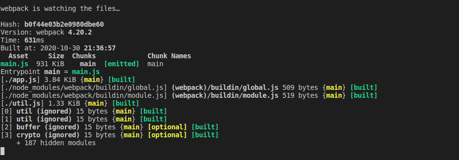
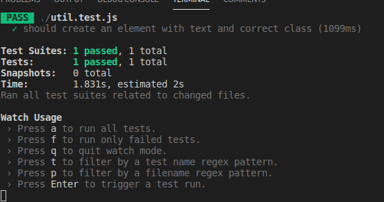
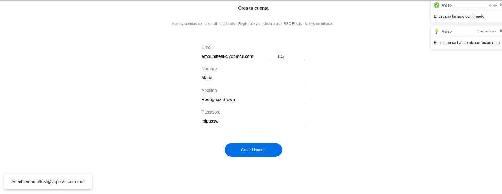

### unit test e2e with Jest puppeteer (user interface testing)
###### `npm install` to install all the modules
###### Webpack `npm start` to pack all the things

###### `npm test` run all the test

